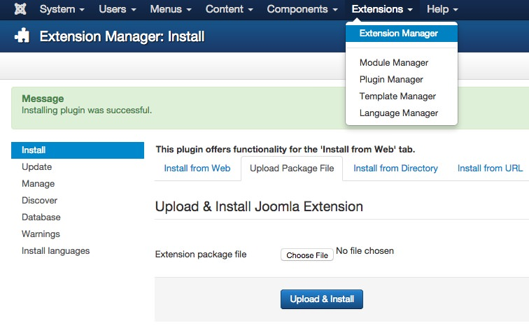
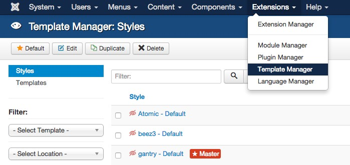

The Gantry framework itself is independent of any template. Each Gantry-enabled template relies on the Gantry framework to provide the underlying base and extensive functionality that enables the creation of such powerful sites.

[ui-tabs position="top-left" active="0"]
[ui-tab title="Joomla"]

[plugin:youtube](https://www.youtube.com/watch?v=KOOuBQpSZDM)

>>>>> A quick way to see the installation process in action is to watch this short screencast. It will provide a run-through of the steps required to quickly and easily get Gantry installed.

[/ui-tab]
[ui-tab title="WordPress"]

[plugin:youtube](https://www.youtube.com/watch?v=W1GmZB2dgNE)

>>>>> A quick way to see the installation process in action is to watch this short screencast. It will provide a run-through of the steps required to quickly and easily get Gantry installed.

[/ui-tab]
[/ui-tabs]

Downloading Gantry
------------------
Gantry has three available download types:

[ui-tabs position="top-left" active="0"]
[ui-tab title="Joomla"]

* __Bundle__: This includes the Framework (library, component & plugins), the Gantry template and associated extensions such as RokNavMenu.
* __Framework__: This contains only the Framework (library, component & plugins).
* __Template__: This contains just the Gantry template.

The installation process is exactly the same for all three. The only difference is the file you are installing. Select the download option best for you. We recommend the bundle for first-time installs.

[Download](http://www.gantry-framework.org/download#joomla) {.border .shadow}

[/ui-tab]
[ui-tab title="WordPress"]

* __Framework__: This contains only the Framework plugin.
* __Theme__: This contains just the Gantry theme.
* __RocketLauncher__: This includes the full WordPress installation, Framework (plugin) and the pre-configured Gantry template (only for NEW installations).

The package you choose to install makes a difference in terms of where you'll be installing the files. **Gantry Framework for WordPress** should be installed like a standard WordPress plugin. The **Gantry Default Theme for WordPress** should be installed the same way you would install any other theme. 

>>>>> Keep in mind that you will need the Gantry framework installed for any Gantry themes to work.

If you don't have WordPress installed on your server yet, you can use the **RocketLauncher** package. It contains the full pre-configured Gantry environment, and is essentially a complete WordPress installation. Choose whichever download option is best for you. We recommend the **RocketLauncher** for first-time WordPress installations.

[Download](http://www.gantry-framework.org/download#wordpress) {.border .shadow}

[/ui-tab]
[/ui-tabs]

Installing Gantry
-----------------

[ui-tabs position="top-left" active="0"]
[ui-tab title="Joomla"]

Install at **Extensions → Extensions Manager → Install**. Select the **Choose File** button, locate the downloaded ZIP and click **Upload & Install** to begin the installation.

 {.border .shadow}

The Gantry template will appear in the **Template Manager**, the Gantry plugins will appear in the **Plugin Manager**, and RokNavMenu will be available from the **Module Manager** (Click **New** to create a new instant of RokNavMenu). The component/library will be hidden, and only accessible from the **Extensions Manager** for uninstallation/upgrading purposes.

[/ui-tab]
[ui-tab title="WordPress"]

To install the Gantry template, you'll need to navigate to **Plugins → Add New** in the admin area of WordPress. From here, select the **Browse** button, locate the downloaded ZIP file, and click **Install Now** to begin installation.

 

The Gantry template will appear in **Themes**, the Gantry plugins will appear in **Plugins**.

[/ui-tab]
[/ui-tabs]

Setting the Gantry Template as Default
--------------------------------------

[ui-tabs position="top-left" active="0"]
[ui-tab title="Joomla"]

If you are using the Gantry template, you will want to set it as the default template so it loads on the front end. Go to **Extensions → Template Manager**, select the **gantry** checkbox, and click **Default** in the button toolbar.

 {.border .shadow}

[/ui-tab]
[ui-tab title="WordPress"]

If you are using the Gantry framework, you'll want to use a Gantry-compatible template. After uploading your template, simply go to the **Appearance → Themes** area in the admin area of WordPress and click **Activate** next to your template.

 

[/ui-tab]
[/ui-tabs]
